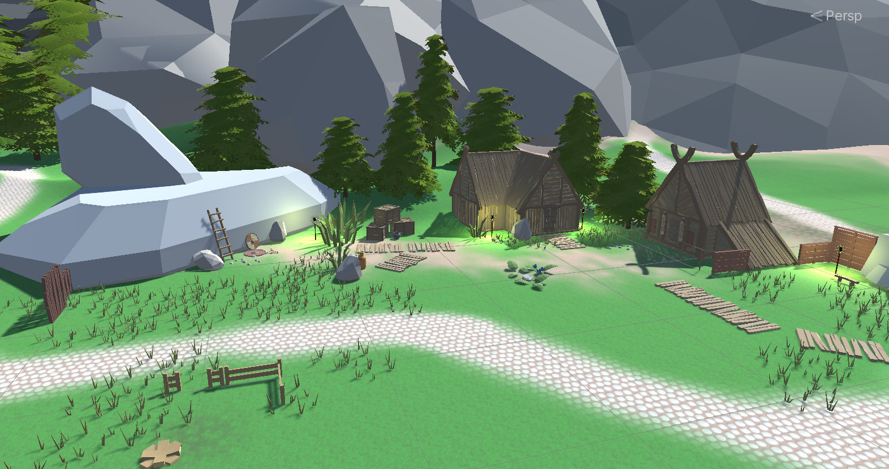
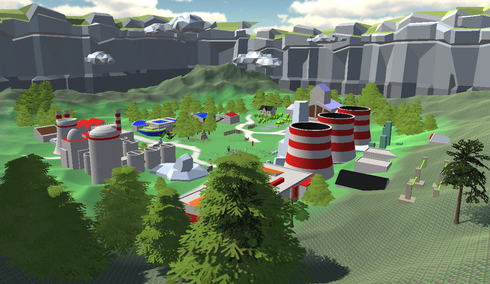

# Tower-grove

A tower-based first person game which aims to restore/REPAIR *coUgH* the environment by repelling the invading human forces and re-establishing those forces of nature (aka elementals). Technically you restore natural selection by reverting humanity back to the medieval age, but we really aren't picky about how you choose to interpret it - so long as it has the word 'repair' in it.

## Authors
Amber Shamsi

James Cunningham

Basile Bron
